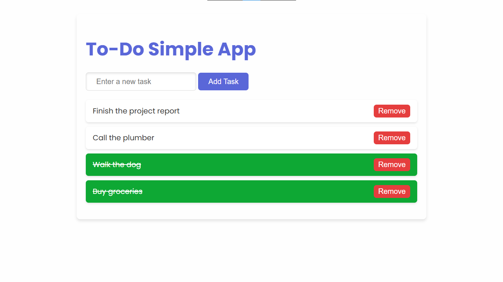

# **To-Do App**

A minimalistic and modern web-based To-Do app that allows users to manage tasks efficiently. The app uses **LocalStorage** to persist tasks across browser sessions.

---

## **Features**
- Add new tasks with a simple input field.
- Mark tasks as completed by clicking on them.
- Remove tasks with a dedicated (Remove) button.
- Tasks are saved in the browser's **LocalStorage**, ensuring persistence.

---

## **Technologies Used**
- **HTML5**: For the app's structure.
- **CSS3 (SASS)**: For modern and responsive styling.
- **JavaScript**: For dynamic functionality and LocalStorage integration.

---

## **How to Use**
1. Clone the repository or download the source files.
2. Open the `index.html` file in any modern web browser.
3. Start adding tasks using the input field and "Add Task" button.
4. Click on a task to mark it as completed or use the "Remove" button to delete it.

---

## **Project Structure**
```
project/
├── index.html            # Main HTML file
├── css/style.scss        # SASS file (source for styling)
├── css/style.css         # Compiled CSS file
├── js/app.js             # JavaScript functionality
└── README.md             # Documentation
```

---

## **Setup Instructions**
1. Ensure you have a browser that supports modern HTML5, CSS3, and JavaScript features.
2. (Optional) If modifying styles, install **SASS** and recompile the styles:
   ```bash
   sass style.scss style.css
   ```
3. Open the `index.html` file to run the app.

---

## **Customization**
- Modify colors, fonts, and styles in the `style.scss` file.
- Add more features like task categories, due dates, or filters by editing `js/app.js`.

---

## **Preview**


---

## **License**
This project is open-source and free to use under the MIT License.
